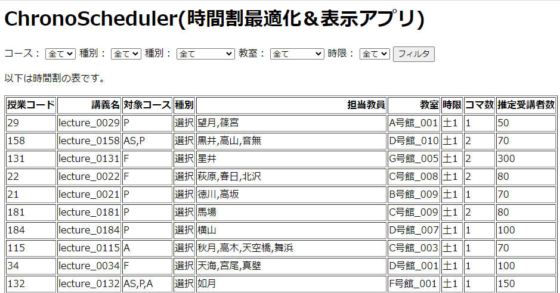
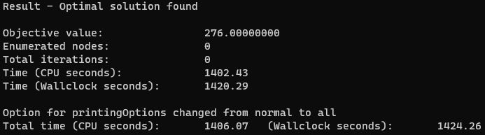

# ChronoScheduler
ChronoScheduler is an application that allows you to create timetables easily within your browser.
Simply upload your timetable data, and let mathematical optimization generate an optimal timetable automatically.
You can then easily review the results by accessing the `/timetable` endpoint.



## 🛠Requirements
* python = "^3.10"
* PuLP = "^2.7.0"
* pandas = "^2.0.2"
* numpy = "^1.24.3"
* openpyxl = "^3.1.2"
* xlrd = "^2.0.1"
* fastapi = "^0.98.0"
* uvicorn = {extras = ["standard"], version = "^0.22.0"}
* jinja2 = "^3.1.2"
* python-multipart = "^0.0.6"

## 🌲Directory
<pre>
chronoscheduler
├───api                  : フロントエンド
│   ├───static           : CSSファイル
│   └───templates        : HTMLファイル
│
├───data
│   └───toy              : 授業情報、時限、教室ファイル
│       └───constraints  : 制約ファイル
│
├───environments         : Dockerfileなどの実行環境
│
├───outputs
│   └───toy              : 最適化後の時間割ファイル
│
└───src                  : ソースコード
</pre>

## ⚙️Installation
Clone this repository.
```bash
git clone https://github.com/kargenk/chronoscheduler.git
```

### Using Poetry
Install Poetry:
```bash
# Install the Poetry dependency management tool, skip if installed
# Reference: https://python-poetry.org/docs/#installation
curl -sSL https://install.python-poetry.org | python3 -
```

Create environment with Poetry:
```bash
cd chronoscheduler/src

# Install the project dependencies and Activate
poetry install
poetry shell
```

## 💻Usage
Make mock data and solve the problem:
```bash
# preparation data for Linear Programing
python generate_mock_data.py

# Solve the problem
python integer_programming.py
```
When you execute `mock_data.py`, you can see mock data files in `data/toy`.
`zeroth_continuous`, `first`, and `second` mean continuous lecture, first semester, and second semester respectively.
And executing `integer_programming.py`, also see optimized timetable file in `outputs/toy/`.

### Launch API server with Docker🐳
```bash
cd chronoscheduler/environments

# Create Docker environment
. create_env.sh

# launch api server
docker compose up
```

Check server response:
```bash
curl localhost:8000/test
```

Returns:
```bash
{'message': 'ChronoScheduler is running!'}
```

You can see optimized Timetable and filter by properties:
```bash
localhost: 8000/timetable
```

<!-- > **Note**
API Docs endpoint: `localhost:8000/docs` -->

## 📝Note
### Formulation
Only integer programming is supported yet...

### Execution Environments
- OS: Ubuntu 20.04
- CPU: 12th Gen Intel(R) Core(TM) i9-12900(16 cores, 24 threads)
- Memory: 64GB

### ⌛Calculation Time
In the above environment, takes 1400~3000 \[sec\]


## 🚀Updates
**2023.07.11**
- add constraints on number of lectures per period
- add SCIP Solver environment, but not integrated

**2023.07.10**
- add pre-solve(for consecutive lectures) and update the constraints process

**2023.06.26**
- add /, /download/{name}, /solve(POST), endpoint
- add /test, /timetable endpoint

## 📧Authors
kargenk a.k.a **gengen**(https://twitter.com/gengen_ml)

## ©License
ChronoScheduler is under [MIT licence](https://en.wikipedia.org/wiki/MIT_License)